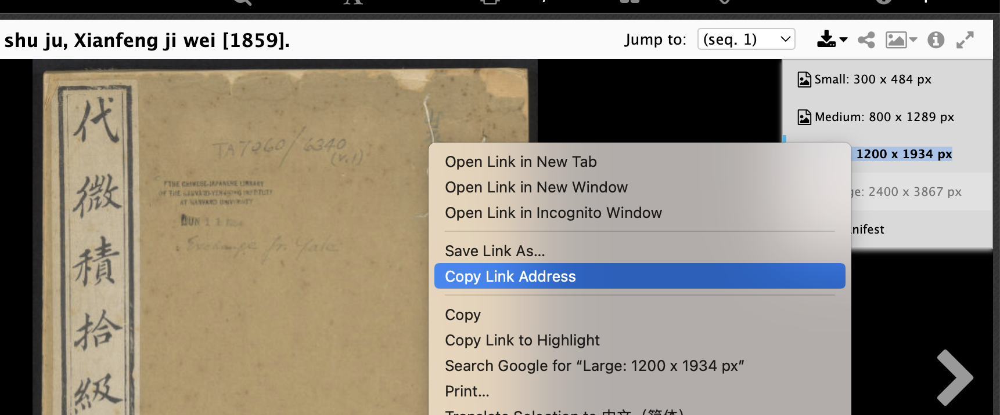

# Harvard Library Book Downloader

### Repository Description
Harvard Library possesses numerous facsimile editions of ancient books. This program automates the bulk downloading process by locating the link to the first image and subsequently downloading the rest.
Certainly! Here is the detailed description for your GitHub repository in English:

---
#### Example Book
The example used in this repository is *代微積拾級* *Daiweiji Sheji*, 咸豐已未[1859] edition. 

- Book link: [https://curiosity.lib.harvard.edu/chinese-rare-books/catalog/49-990081640940203941](https://curiosity.lib.harvard.edu/chinese-rare-books/catalog/49-990081640940203941)
- First image link: [https://iiif.lib.harvard.edu/manifests/view/drs:430970820$1i](https://iiif.lib.harvard.edu/manifests/view/drs:430970820$1i)

To download the images, locate the link for the first image from the right side download option, as shown in the screenshot below:



The image link obtained is: [https://ids.lib.harvard.edu/ids/iiif/430970822/full/1200,/0/default.jpg?download&caption](https://ids.lib.harvard.edu/ids/iiif/430970822/full/1200,/0/default.jpg?download&caption)

Then, replace the numeric part of the link in the code. This book has 252 pages, so the download number can be set to 252.


## Additional Functionality

### Merge Images into a PDF

After downloading the images, this program can merge all the book images into a single PDF file. This is useful for offline reading and printing.

### Fullscreen Version for Right-to-Left Reading

The program also provides a fullscreen version of the PDF, formatted for right-to-left reading, which is suitable for traditional Chinese texts.

## Usage Instructions

1. **Download Images**: Run the script to download all images for the book.
2. **Merge into PDF**: Use the provided script to merge the downloaded images into a PDF file.
3. **Generate Fullscreen PDF**: Use the additional script to format the PDF for fullscreen, right-to-left reading.


### Dependencies

Make sure you have the following Python packages installed:

- `requests`
- `PyPDF2`

You can install them using pip:

```bash
pip install PyPDF2
```

This repository provides a comprehensive solution for downloading, merging, and formatting ancient book facsimiles from Harvard Library. Feel free to contribute and enhance the functionality.

---

By following these steps, users can download images, merge them into a PDF, and create a fullscreen version suitable for right-to-left reading.
